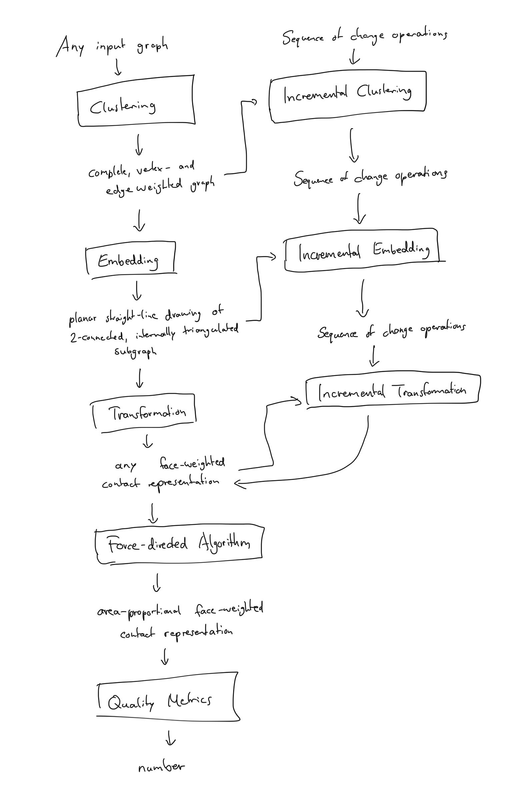
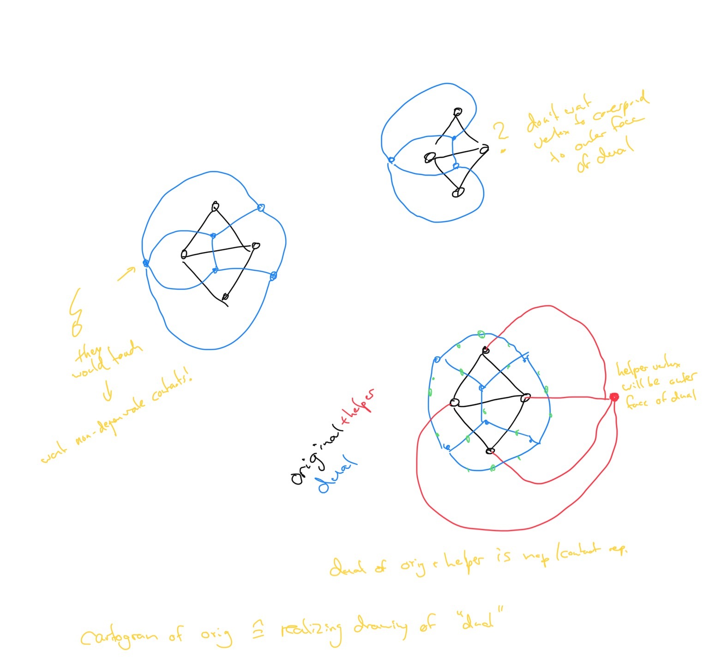

__2020-03-05__

- Focus on better initial layout (Kleist/Thomassen) only if we have time!

TODOs:
- [x] Try merging vertices when they get too close to one another
    - Only contract edges; but not edges between 2 3-degree verices
- [ ] Implement other dynamic operations with additional subdivision vertices
- [x] Implement quality metrics: statistical accuracy, local fatness
    - Implemented: polygon area / area of regular n-gon in smalltest enclosing circle (though more "global"?)
    - Other idea 1: [incircle / circumcircle](https://mathematica.stackexchange.com/questions/121987/how-to-find-the-incircle-and-circumcircle-for-an-irregular-polygon)
    - Other idea 2: area of the smallest circle of the largest circles fitting on the inside of polygon, touching two adjacent segments
        - Unnormalized. What about vertices with internal angle >180deg?
    - Problems with some ideas: infinitesimal tweaks should have infinitesimal impact on fatness
- [ ] Think about test case generation

__2020-02-13__

- Transformation algorithm in pseudocode
- Problem with initial force-directed implementation
    - Subdivision vertices are very rigid and severly restrict movement of other vertices
    - Tight corridors are being generated
    - Edge crossings are still being generated

TODOs:
- [x] Try to balance distance between subdivision vertices and their neighbors
- [ ] Try adding repulsive forces between vertices and edges of the same face -> local fatness
- [x] Fix PrEd implementation
    - Works, but is pretty slow now!
- [ ] Try speeding things up by only adding helper vertices after a couple of iterations
    - Would require different transformation as current implementation relies on subdivision vertices to be valid contact representation
- [ ] Theory and practice together: start with optimal drawing already (Kleist/Thomassen)
    - Would be inconsistent with how we apply dynamic updates though!
- [x] Read Circular Arc Kobourov Cartogram: one-bend to circular arc?
    - No dummy vertices, flow network problem
- [x] Reread Lombardi Spring Embedder: also with one-bend helper vertex?
    - Dummy vertex added only in second phase, and _only those_ are displaced in second force-directed phase
- [x] Read Thomassen paper

__2020-01-30__

- More algorithm drafting / implementation

TODOs:
- [x] Rename "Embedding" phase to "Filtering + Embedding"
- [x] Send algorithm in pseudocode to Tamara
- [ ] Torsten: graphs of degree 3 are area-universal (Thomassen)
    - Max degree? Outer face might not have degree 3. We could augment and remove though!
- [x] Force-directed algorithm
    - Push vertices towards bisector of the two adjacent edges in face
    - Weight different vertex displacements: based on local fatness
        - If adjacent to two faces: want 180deg angle
        - If adjacent to three faces: want 120deg angle
    - Prevent edge crossings!
- Up next: bigger test instances, dynamics

__2020-01-16__

- Algorithm and evaluation structure
- Draft input graph -> graph on which we run force-directed layout transformation
- Title: Visualizing dynamic clustered data using area-proportional maps

Changes:
- "Embedding" -> "Filtering + Embedding"

__2020-01-09__

Drawing planar 3-trees with given face areas
- straight line edges only
- recursive construction based on barycentric coordinates in K4

Drawing graphs with prescribed face faces
- edges with 1 bend
- uses air pressure algorithms internally
- not organic-looking at all
- difficult to adapt to dynamic setting

On rectilinear duals for vertex-weighted Plane graphs
- definition rectangular/rectilinear dual
- theoretical results on complexity of cartogram

Planar graphs and face areas: area universality
- area universal graphs: straight line drawing exists for arbitrary face areas
- Duality of problems: cartogram for vertex-weighted graph vs realizing drawing (of dual) with given face areas

TODOs
- [x] Can Linda Kleist result as initial configuration for force-directed?
- [x] Check if Webcola can be used to ensure no edge crossings are created! -> no
- [x] Draft algorithm and evaluation structure: black boxes with input and output
- [x] Title for thesis
- [x] Think about quality metrics
    - “Local fatness”
    - Polygonal complexity
    - Can we create constraints for those?
- [x] Think about research questions for evaluation
    - How much worse is applying changes to just starting from scratch?
    - Think in terms of possible plots

https://ialab.it.monash.edu/~dwyer/
http://www.adaptagrams.org
https://ialab.it.monash.edu/webcola/

__2019-12-19__

Explored diffusion algorithm for cartograms (M. Newman)
- Plain old C, input is density matrix and output maps cells to a new position where they would diffuse to
- Took some time to get it running and to visualize the data
- Smooth animations from initial layout to converged state possible -> Demo
- Limitations
    - Not 100% statistically accurate
    - Works with fixed-size matrix of initial densities, inserting new countries might be hard
    - Hard/impossible to adapt to account for edge weights

Started writing down conventions & co.

__2019-12-12__

No meeting: Tamara’s son sick

__2019-12-05__

No meeting: Tamara away

__2019-11-28__

We should be able to achieve perfectly statistically accurate cartograms
- Can’t have all three of perfect statistical, geographic and topological accuracy
- We don’t care about geographic accuracy because we don’t have a true underlying geographic map!

Framework
- Weighted cluster graph -> any contact representation -> statistically accurate contact representation
    - Repeat last step after dynamic update
    - How to get initial map / contact representation?
        - ~~Circle packing?~~
        - Orthogonal polygons?
        - Shift/Schnyder + Impred + “Dual”?
    - Which algorithm to use to generate statistically accurate contact representation / cartogram?
        - For now: diffusion algorithm
- Goals for resulting map
    - Organic
    - Locally fat regions
- Exploration of permitted operations on cluster graph
    - no rivers/lakes -> internally triangulated cluster graph
    - vertex removal
    - vertex insertion

How to visualize edge weights?
- As length of common boundary of two countries

Until next meeting: start coding and getting a feel for things

__2019-11-21__

No meeting: Tamara away

__2019-11-14__

Cartograms vs graph embeddings
- Agreed to drop graph embeddings / ML direction and continue with cartograms

New directions to explore for generating cartograms
- Air-pressure cartograms
- Gosper Map (D. Auber)

Dynamic operations on cluster graph
- New vertices
- Edges appear or disappear while keeping embedding stable
- Weights on vertices and/or edges change

Until next meeting: more research on cartograms

__2019-11-07__

No meeting: Tamara sick

__2019-10-31__

No meeting: Christian sick

